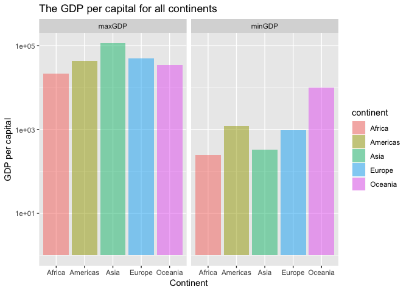
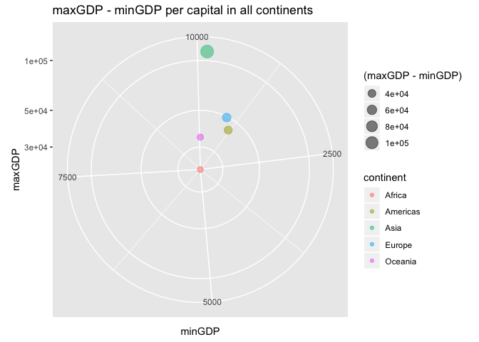

hw03
================
Ziqiang Tang

Overview
--------

The aim of this aissignment is to manipulate and explore a dataset with the dplyr package, complmented by visulization made with ggplot2.

Task menu
---------

First, let's library all dataset.

``` r
library( gapminder )
library( tidyverse )
```

    ## -- Attaching packages --------------------------------------- tidyverse 1.2.1 --

    ## <U+221A> ggplot2 3.0.0     <U+221A> purrr   0.2.5
    ## <U+221A> tibble  1.4.2     <U+221A> dplyr   0.7.6
    ## <U+221A> tidyr   0.8.1     <U+221A> stringr 1.3.1
    ## <U+221A> readr   1.1.1     <U+221A> forcats 0.3.0

    ## -- Conflicts ------------------------------------------ tidyverse_conflicts() --
    ## x dplyr::filter() masks stats::filter()
    ## x dplyr::lag()    masks stats::lag()

``` r
library( knitr )
```

### 1. Get the maximum and minimum of GDP per capital for all continents

``` r
GDP_per_cap <- gapminder %>% 
  group_by( continent ) %>% 
  summarize( minGDP = min( gdpPercap ),
            maxGDP = max( gdpPercap ))
GDP_per_cap%>% 
    kable( col.names = c( "Continent", "Min GDP", "Max GDP"))
```

| Continent |     Min GDP|    Max GDP|
|:----------|-----------:|----------:|
| Africa    |    241.1659|   21951.21|
| Americas  |   1201.6372|   42951.65|
| Asia      |    331.0000|  113523.13|
| Europe    |    973.5332|   49357.19|
| Oceania   |  10039.5956|   34435.37|

#### Let's try to view the minimum and maximum of GDP per capital for all continents.

``` r
GDP_per_cap %>% 
  ##get the col 2 and 3 data_set
  gather( key = min_or_max, value = GDP_per_cap, 2:3 ) %>%  
  ##plot the data with color fill
  ggplot( aes( x = continent, y = GDP_per_cap, fill = continent )) +
  ##the height of bars reporesents the data
  geom_col( alpha = 0.5 ) +
  ##scale the y-axis
  scale_y_log10() +
  ##warp with maxGDP and minGDP with the y-scale is not aligned
  facet_wrap( .~min_or_max )  +
  ggtitle( "The GDP per capital for all continents" ) +
  xlab( "Continent") +
  ylab( "GDP per capital" )
```



#### Let's try to view the difference between max GDP and min GDP per capital for all continents.

``` r
GDP_per_cap %>% 
ggplot( aes( x = minGDP, y = maxGDP )) +
    scale_size_area() +
  geom_point( aes( color=continent, size = ( maxGDP - minGDP )), 
             alpha =0.5 ) +
  coord_polar() +
  scale_y_log10() +
  ggtitle( "maxGDP - minGDP per capital in all continents" )
```

 This polar diagram give us the intuition that the largeset GDP difference continent is Asia while the smallest GDP difference is Africa.

### 2. Look at the spread of GDP per capital within the continents

``` r
Spread_GDP <- gapminder %>%   
  group_by( continent ) %>% 
  summarise( sd_GDP = sd( gdpPercap ),
            mean_GDP = mean( gdpPercap ),
            max_GDP = max( gdpPercap ),
            min_GDP = min( gdpPercap ))

Spread_GDP %>% 
  mutate( gdp_range = paste( min_GDP, max_GDP, sep = " ~ " )) %>%
  arrange( max_GDP-min_GDP ) %>% 
  kable()
```

| continent |    sd\_GDP|  mean\_GDP|   max\_GDP|    min\_GDP| gdp\_range                |
|:----------|----------:|----------:|----------:|-----------:|:--------------------------|
| Africa    |   2827.930|   2193.755|   21951.21|    241.1659| 241.1658765 ~ 21951.21176 |
| Oceania   |   6358.983|  18621.609|   34435.37|  10039.5956| 10039.59564 ~ 34435.36744 |
| Americas  |   6396.764|   7136.110|   42951.65|   1201.6372| 1201.637154 ~ 42951.65309 |
| Europe    |   9355.213|  14469.476|   49357.19|    973.5332| 973.5331948 ~ 49357.19017 |
| Asia      |  14045.373|   7902.150|  113523.13|    331.0000| 331 ~ 113523.1329         |

From this table, it could also been seen that the largest GDP range is Asia while smallest GDP range is Africa.

#### let's view the spread using viloin plot

``` r
gapminder %>% 
  ggplot( aes( continent, gdpPercap )) +
  geom_violin( aes( fill = continent ), alpha = 0.5 ) +
  geom_jitter( aes( fill = continent ), alpha=0.03 ) +
  scale_y_log10() +
  labs( x = "continent", y = "GDP per capita in log scale", 
  title = "spread of GDP per capita within the continents")
```


#### let's view other information

``` r
Spread_GDP %>%
  gather( key = spread, value = Spread_GDP, 2:5 ) %>%  
  ggplot( aes( x = continent, y = Spread_GDP, fill = continent )) +
  geom_bin2d( alpha = 0.5 ) +
  facet_wrap( .~spread )  +
  scale_y_log10() +
  labs( x = "spread data", y = "GDP per capita in log scale", 
  title = "spread of GDP per capita within the continents" )
```


From the above figure, we can see that Asia and Americas have similar mean value while have different strandard value. This is corresponds to what we expected since Asia has larger max - min value of GDP per capital than America.

### 3. Compute a trimmed mean of life expectancy for different years. Or a weighted mean, weighting by population. Just try something other than the plain vanilla mean.

#### let's first look at the table

``` r
mean_lifeExp <- gapminder %>%
  group_by( year ) %>%
  summarize( mean = mean( lifeExp ),
            weighted_mean = weighted.mean( lifeExp, pop )) 

arrange( mean_lifeExp ) %>% 
  knitr::kable()
```

|  year|      mean|  weighted\_mean|
|-----:|---------:|---------------:|
|  1952|  49.05762|        48.94424|
|  1957|  51.50740|        52.12189|
|  1962|  53.60925|        52.32438|
|  1967|  55.67829|        56.98431|
|  1972|  57.64739|        59.51478|
|  1977|  59.57016|        61.23726|
|  1982|  61.53320|        62.88176|
|  1987|  63.21261|        64.41635|
|  1992|  64.16034|        65.64590|
|  1997|  65.01468|        66.84934|
|  2002|  65.69492|        67.83904|
|  2007|  67.00742|        68.91909|

#### let's view it in the his

``` r
mean_lifeExp %>% 
  gather( key = mean_value, value = mean_lifeExp, 2:3 ) %>% 
  ggplot( aes(x = year, y = mean_lifeExp )) +
  geom_line( linetype = "dashed", color = "red" ) +
  geom_point( color = "black" ) +
  facet_wrap( .~mean_value )  +
  labs( x = "Year", y = "LifeExp", 
  title = "Mean and Weighed Mean of life expectancy vs each year" )
```


### 4.How is life expectancy changing over time on different continents?

``` r
Lifechange <- gapminder %>% 
  group_by( year, continent ) %>% 
  summarize( Mean_lifeExp = mean( lifeExp )) 

##let's view the first 10 rows
knitr::kable( head( Lifechange, 10 ))  
```

|  year| continent |  Mean\_lifeExp|
|-----:|:----------|--------------:|
|  1952| Africa    |       39.13550|
|  1952| Americas  |       53.27984|
|  1952| Asia      |       46.31439|
|  1952| Europe    |       64.40850|
|  1952| Oceania   |       69.25500|
|  1957| Africa    |       41.26635|
|  1957| Americas  |       55.96028|
|  1957| Asia      |       49.31854|
|  1957| Europe    |       66.70307|
|  1957| Oceania   |       70.29500|

#### Let's view the mean\_lifeExp

``` r
Lifechange %>%
  ggplot( aes( x = year, y = Mean_lifeExp, color = continent )) +
  geom_line() +
  geom_point( color = "black" ) +
  labs( x = "Year", y = "LifeExp", 
  title = "life expectancy changing over time on different continents" )
```


#### Let's view the growth of lifeExp

``` r
Growth_life <- gapminder %>% 
  group_by( continent ) %>% 
  mutate( growth = lifeExp - lag( lifeExp )) 


##let's view the first 10 rows
knitr::kable( head( Growth_life, 10 )) 
```

| country     | continent |  year|  lifeExp|       pop|  gdpPercap|  growth|
|:------------|:----------|-----:|--------:|---------:|----------:|-------:|
| Afghanistan | Asia      |  1952|   28.801|   8425333|   779.4453|      NA|
| Afghanistan | Asia      |  1957|   30.332|   9240934|   820.8530|   1.531|
| Afghanistan | Asia      |  1962|   31.997|  10267083|   853.1007|   1.665|
| Afghanistan | Asia      |  1967|   34.020|  11537966|   836.1971|   2.023|
| Afghanistan | Asia      |  1972|   36.088|  13079460|   739.9811|   2.068|
| Afghanistan | Asia      |  1977|   38.438|  14880372|   786.1134|   2.350|
| Afghanistan | Asia      |  1982|   39.854|  12881816|   978.0114|   1.416|
| Afghanistan | Asia      |  1987|   40.822|  13867957|   852.3959|   0.968|
| Afghanistan | Asia      |  1992|   41.674|  16317921|   649.3414|   0.852|
| Afghanistan | Asia      |  1997|   41.763|  22227415|   635.3414|   0.089|

#### let's view the whether the lifeExp for each year is higher than the mean value of lifeExp or not

``` r
higher_mean <- gapminder %>%
  group_by( year, continent ) %>% 
  mutate( mean_life = mean( lifeExp )) %>% 
  mutate( lower_OR_higher = if_else( lifeExp < mean_life ,
                                     "+", "-" )) %>% 
  select ( year, continent, 
          lifeExp, lower_OR_higher ) %>% 
  arrange( continent, year ) 

knitr::kable( head( higher_mean, 10 ))
```

|  year| continent |  lifeExp| lower\_OR\_higher |
|-----:|:----------|--------:|:------------------|
|  1952| Africa    |   43.077| -                 |
|  1952| Africa    |   30.015| +                 |
|  1952| Africa    |   38.223| +                 |
|  1952| Africa    |   47.622| -                 |
|  1952| Africa    |   31.975| +                 |
|  1952| Africa    |   39.031| +                 |
|  1952| Africa    |   38.523| +                 |
|  1952| Africa    |   35.463| +                 |
|  1952| Africa    |   38.092| +                 |
|  1952| Africa    |   40.715| -                 |
